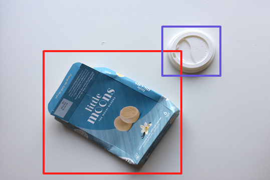

# Boostcamp level2 p-stage - 19조 빨간맛
## Object Detection for classifying recycling item
## (재활용품목 분류를 위한 Object Detection)

# Getting Started
## Dependencies
* albumentations==1.0.3
* pycocotools==2.0.2
* opencv-python==4.5.3.56
* tqdm==4.62.3
* torchnet==0.0.4
* pandas==1.3.3
* map-boxes==1.0.5
* pytorch==1.7.1
* [Swin Transformer for Object Detection](https://github.com/SwinTransformer/Swin-Transformer-Object-Detection)
* [UniverseNet](https://github.com/shinya7y/UniverseNet)
* [Yolo5](https://github.com/ultralytics/yolov5/)

## library getting_started
* [Swin Transformer for Object Detection get_started](https://github.com/open-mmlab/mmdetection/blob/master/docs/get_started.md)
* [UniverseNet get_started](https://github.com/shinya7y/UniverseNet/blob/master/docs/get_started.md)
* [Yolo5](https://github.com/boostcampaitech2/object-detection-level2-cv-19/blob/jsg_yolo5/yolov5/README_original.md#quick-start-examples)

# Dataset
## 재활용 쓰레기 데이터셋 / Aistages(Upstage) - CC BY 2.0
This dataset consist of image, classes and bboxes. The number of image is 9754, the number of trainset and is 4883 and 4871, respectively. Also size of image is (1024,1024).

## Class Description
| class | trash |
|---|:-------------:|
| 0 | General trash |
| 1 | Paper         |
| 2 | Paper pack    |
| 3 | Metal         |
| 4 | Glass         |
| 5 | Plastic       |
| 6 | Styrofoam     |
| 7 | Plastic bag   |
| 8 | Battery       |
| 9 | Clothing      |

## Dataset folder path
```
 dataset
 ├── train.json
 ├── test.json
 ├── train
 └── test
```

# Train Model & Inference
## [Swin-Transformer-Object-Detection](./Swin-Transformer-Object-Detection/README.md)