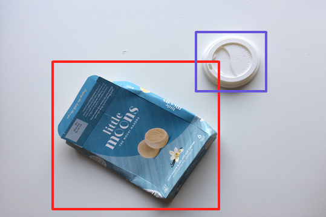
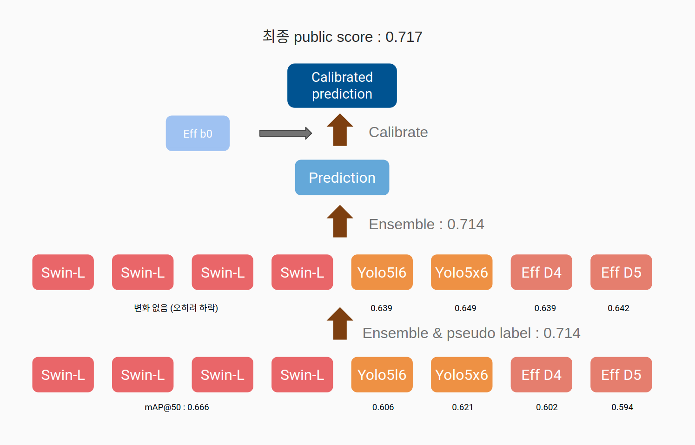

# Object Detection for classifying recycling item  

## 1. Introduction

바야흐로 대량 생산, 대량 소비의 시대. 우리는 많은 물건이 대량으로 생산되고, 소비되는 시대를 살고 있습니다. 하지만 이러한 문화는 '쓰레기 대란', '매립지 부족'과 같은 여러 사회 문제를 낳고 있습니다.  
분리수거는 이러한 환경 부담을 줄일 수 있는 방법 중 하나입니다. 잘 분리배출 된 쓰레기는 자원으로서 가치를 인정받아 재활용되지만, 잘못 분리배출 되면 그대로 폐기물로 분류되어 매립 또는 소각되기 때문입니다.  
따라서 우리는 사진에서 쓰레기를 Detection 하는 모델을 만들어 이러한 문제점을 해결해보고자 합니다. 문제 해결을 위한 데이터셋으로는 일반 쓰레기, 플라스틱, 종이, 유리 등 10 종류의 쓰레기가 찍힌 사진 데이터셋이 제공됩니다.  
여러분에 의해 만들어진 우수한 성능의 모델은 쓰레기장에 설치되어 정확한 분리수거를 돕거나, 어린아이들의 분리수거 교육 등에 사용될 수 있을 것입니다. 부디 지구를 위기로부터 구해주세요! 🌎  

Input : 쓰레기 객체가 담긴 이미지와 bbox 정보(좌표, 카테고리)가 모델의 인풋으로 사용됩니다. bbox annotation은 COCO format으로 제공됩니다.
Output : 모델은 bbox 좌표, 카테고리, score 값을 리턴합니다. 이를 submission 양식에 맞게 csv 파일을 만들어 제출합니다.




## 2. Dataset

**재활용 쓰레기 데이터셋 / Aistages(Upstage) - CC BY 2.0**  

- 전체 이미지 개수: 9754장
- 10 class: General trash, Paper, Paper pack, Metal, Glass, Plastic, Styrofoam, Plastic bag, Battery, Clothing
- 이미지 크기: (1024, 1024)

### Get Dataset

```
wget https://aistages-prod-server-public.s3.amazonaws.com/app/Competitions/000076/data/data.tar.gz
```

### Class Description
| class | trash |
|---|:-------------:|
| 0 | General trash |
| 1 | Paper         |
| 2 | Paper pack    |
| 3 | Metal         |
| 4 | Glass         |
| 5 | Plastic       |
| 6 | Styrofoam     |
| 7 | Plastic bag   |
| 8 | Battery       |
| 9 | Clothing      |

### Dataset folder path
```
 dataset
 ├── train.json
 ├── test.json
 ├── train
 └── test
```

## 3. Prerequisites

### Dependencies
* albumentations==1.0.3
* pycocotools==2.0.2
* opencv-python==4.5.3.56
* tqdm==4.62.3
* torchnet==0.0.4
* pandas==1.3.3
* map-boxes==1.0.5
* pytorch==1.7.1
* [Swin Transformer for Object Detection](https://github.com/SwinTransformer/Swin-Transformer-Object-Detection)
* [UniverseNet](https://github.com/shinya7y/UniverseNet)
* [EfficientDet (PyTorch)](https://github.com/rwightman/efficientdet-pytorch)
* [Yolo5](https://github.com/ultralytics/yolov5/)
* [YOloX](https://github.com/Megvii-BaseDetection/YOLOX/blob/main/setup.py)

### Library getting_started
* [Swin Transformer for Object Detection get_started](https://github.com/open-mmlab/mmdetection/blob/master/docs/get_started.md)
* [UniverseNet get_started](https://github.com/shinya7y/UniverseNet/blob/master/docs/get_started.md)
* [EfficientDet (PyTorch)](https://github.com/rwightman/efficientdet-pytorch#environment-setup)
* [Yolo5](https://github.com/boostcampaitech2/object-detection-level2-cv-19/blob/jsg_yolo5/yolov5/README_original.md#quick-start-examples)
* [YoloX](https://github.com/Megvii-BaseDetection/YOLOX#quick-start)
)

### Quick mmdetection-based library installation in Ustage Object Detecction server 
* mmdetection 계열이 이미 깔려있는 서버환경에서 빠르게 다른 버전의 mmdetection-based library를 설치 할 수 있다.
* upstage level2 p-stage object detection 서버 사용시 기존 환경을 클론한 환경을 만든다.
```
conda create --name detection_custom --clone detection  # 환경이 설치되어있는 detection 가상환경을 클론
conda activate detection_custom
```
* mmdetection-based library installation
    * mmdetection을 기반으로한 Swin Transformer for Object Detection 설치 예시
```
# Swin Transformer for Object Detection 설치
# https://github.com/SwinTransformer/Swin-Transformer-Object-Detection
git clone https://github.com/SwinTransformer/Swin-Transformer-Object-Detection.git
cd Swin-Transformer-Object-Detection
pip install -r requirements/build.txt
pip install -v -e .
cd ..
# (optional) Apex설치
git clone https://github.com/NVIDIA/apex
cd apex
pip install -v --disable-pip-version-check --no-cache-dir ./
cd ..
```

## 4. Pipeline



<br>

### Stage 1: Train individual models

| Model | mAP@50 |
|---|:-------------:|
| [Swin-Transformer-Object-Detection](./Swin-Transformer-Object-Detection/README.md)| Swin-B: 0.645 / Swin-L: 0.666   |
| [YoloV5](yolov5/README.md)                                                        | yolo5l6: 0.620 / yolo5x6: 0.621 |
| [EfficientDet (PyTorch)](efficientdet-pytorch/README.md)                          | D4_ap: 0.602 / D5_ap: 0.594     |
| [UniverseNet](./UniverseNet/README.md)                                            | 0.567                           |
| [YolovX](yolox/README.md)                                                         | 0.548                           |

<br>

### Stage 2: Ensemble model and Pseudo label

 a. Put inferenced json files in `ensemble/results`

```
 ensemble
 ├── ensemble.py
 └── results
     └── result_swin.json
     └── result_yolo.json
     └── ...
     └── weights.txt
```

 b. write weights.txt
 
```
result_swin 1.2
result_yolo 1.2
...
```

 c. Ensemble results
 
 ```
 cd ensemble
 python ensemble.py --json_path ../dataset/train.json`
 ```
 
 d. Make pseudo labled json file
 
 ```
 cd ../pseudo_labeling
 python make_pseudo_dataset.py --train_json_path ../dataset/train.json --test_json_path ../dataset/test.json --result_json_path ../ensemble/ensembled_result.json`
 ```
 
| Combinations | mAP@50 |
|---|:-------------:|
| Swin-L x 2| 0.687|
| Swin-L + yolo5l6| 0.687|
| Swin-L x 2 + yolo5l6| 0.700|
| Swin-L x 2 + yolo5l6| 0.700|
| Swin-L x 3 + yolo5l6 + effdetD5| 0.707|
| Swin-L x 4 + yolo5l6 + effdetD4 + effdetD5| 0.711|
| Swin-L x 4 + yolo5l6 + yolo5x6 + effdetD4 + effdetD5| 0.714|

<br>

### Stage 3: Train individual models with Pseudo label

Load weights from Stage1 and train with lower epochs and learning rate.

| Model | mAP@50 without Pseudo Labeling | mAP@50 with Pseudo Labeling |
|---|:-------------:|:-------------:|
| [Swin-Transformer-Object-Detection](./Swin-Transformer-Object-Detection/README.md)| Swin-L: 0.666   | Swin-L: 0.659   |
| [YoloV5](yolov5/README.md)                                                        | yolo5l6: 0.620 / yolo5x6: 0.621 | yolo5l6: 0.639 / yolo5x6: 0.649 |
| [EfficientDet (PyTorch)](efficientdet-pytorch/README.md)                          | D4_ap: 0.602 / D5_ap: 0.594     | D4_ap: 0.639 / D5_ap: 0.642     |

<br>

### Stage 4: Ensemble model and Pseudo label

Same as in Stage2 but use results from Stage3

| Combinations | mAP@50 without Pseudo Labeling | mAP@50 with Pseudo Labeling |
|---|:-------------:|:-------------:|
| Swin-L x 4 + yolo5l6 + yolo5x6 + effdetD4 + effdetD5| 0.714| 0.714|

<br>

### Stage 5: Train Classifier

a. If KFold training

`python kfold.py --json_path /path/to/json_file.json --n_splits 5`

b. Train for each split

- run train_clf.ipynb

c. Inference for each split

- run inference_clf.ipynb

<br>

### Stage 6: Calibrate score

a. put inferenced outputs(\*.pkl) to `clf/results`

```
clf
├── calibrate_score.py
├── ...
├── results
│   ├── split1.pkl
│   ├── split2.pkl
│   └── ...
└── ...
```

b. calibrate scores

`python clf/calibrate_score.py --json_path /path/to/ensembled_result.json`

| Combinations | mAP@50 before calibration | mAP@50 after calibration |
|---|:-------------:|:-------------:|
| Swin-L x 4 + yolo5l6 + yolo5x6 + effdetD4 + effdetD5| 0.714| 0.717|

## 5. Ouput Examples


<!-- clf? notebooks? -->
